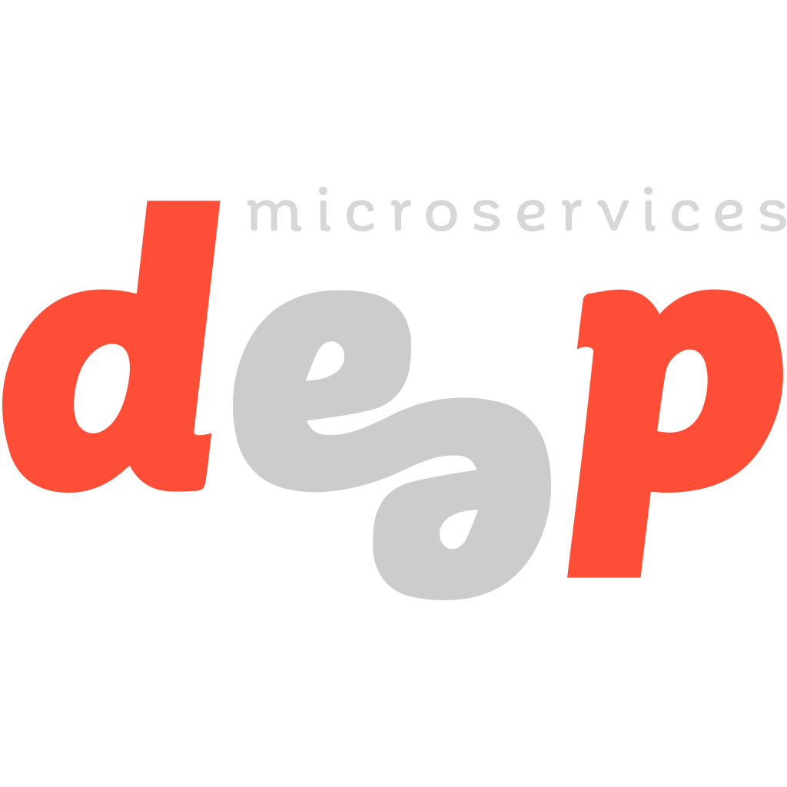

DEEP Microservices HelloWorld
=============================

## Digital Enterprise End-to-end Platform

[DEEP](https://github.com/MitocGroup/deep) stands for Digital Enterprise End-to-end Platform, a low cost and low maintenance digital platform powered by abstracted services from AWS. We enable businesses and developers to achieve more by doing less.

[DEEP Microservice](docs/microservice.md) is the predefined structure of a microservice (an application) in DEEP. There is clear separation between frontend, backend and database, as well as unit tests and documentation.

> [DEEP Marketplace](https://www.deep.mg) (aka [www.deep.mg](https://www.deep.mg)) is a web application built using DEEP and published on serverless environment from [Amazon Web Services](https://aws.amazon.com) (aka [aws.amazon.com](https://aws.amazon.com)). We make it faster and easier for developers to build and publish their software, as well as for businesses to discover and test applications they are looking for. Our goal is to connnect businesses with developers, and empower technical teams to build self-service software that none technical teams could use. The marketplace is like Apple's App Store or Google's Play for web applications that run natively on cloud providers like AWS.

## License

This repository can be used under the MIT license.
> See [LICENSE](LICENSE) for more details.

## Sponsors

This repository is being sponsored by:
> [Mitoc Group](http://www.mitocgroup.com)
